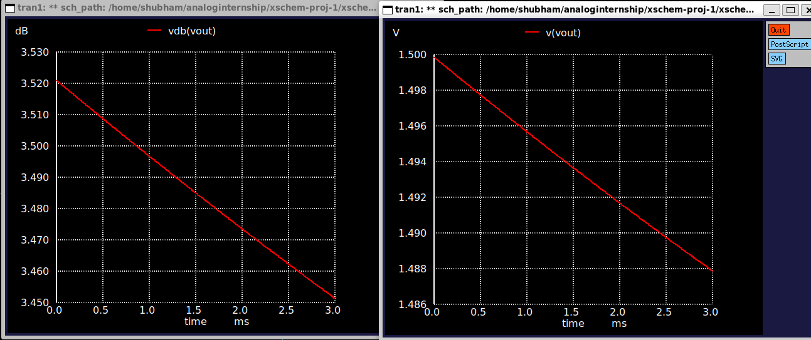
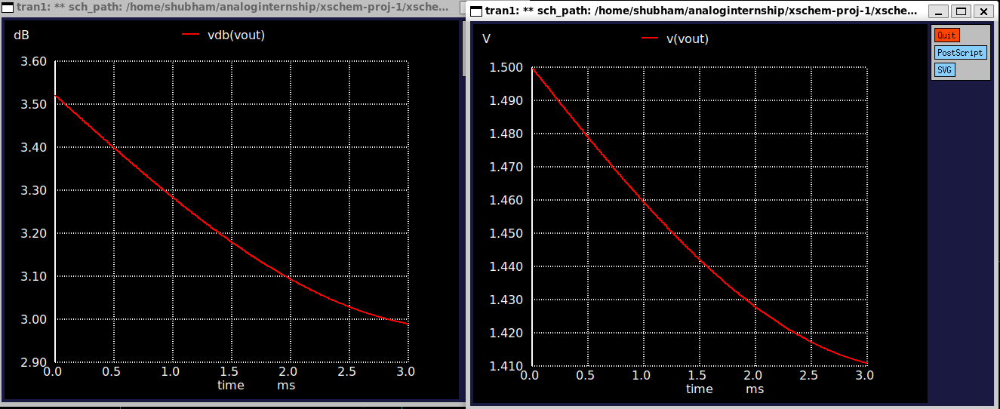
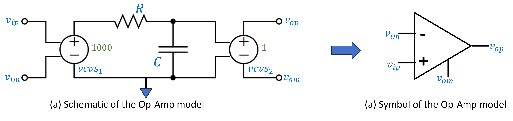
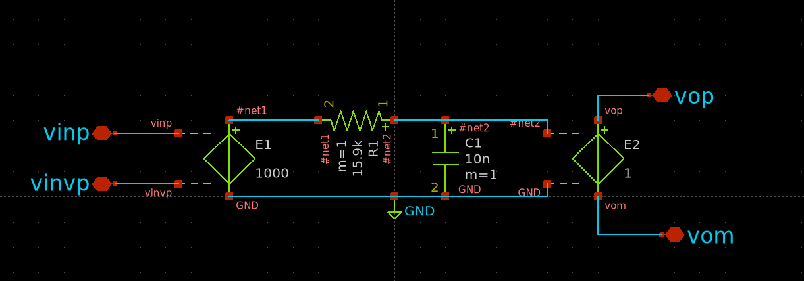
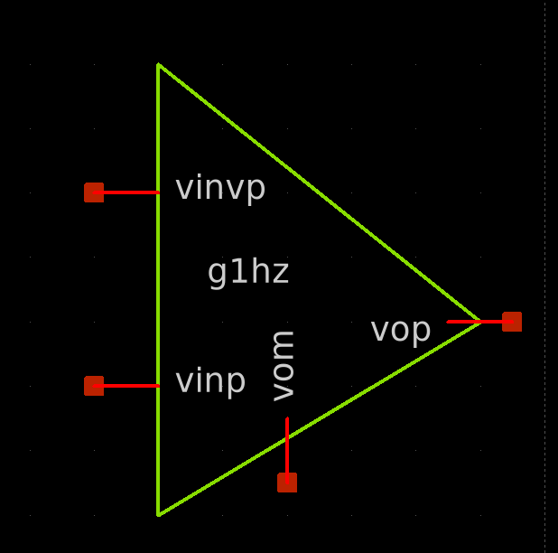

# Assignment 1

## Circuit Diagram

---

## Question 1: Determine the type of circuit

**Answer:**  
The given circuit is an **active high-pass filter** implemented using an **inverting op-amp configuration**. The input signal passes through a capacitor followed by a resistor, which together form the high-pass filtering stage. The op-amp amplifies the filtered signal with a gain determined by the ratio of the feedback and input resistors.

---

## Question 2: Write the s-domain transfer function for the circuit

**Answer:**  
Given component values:
- $C_i = 4.7 \, \mu\text{F}$
- $R_i = 5 \, \text{k}\Omega$
- $R_f = 5 \, \text{k}\Omega$

The transfer function $H(s)$ for an inverting high-pass filter is:

$$
H(s) = -\frac{R_f}{R_i} \cdot \frac{sRC}{1 + sRC}
$$

Substituting the given values:

$$
H(s) = -1 \cdot \frac{s \cdot 5000 \cdot 4.7 \times 10^{-6}}{1 + s \cdot 5000 \cdot 4.7 \times 10^{-6}}
$$

$$
H(s) = -\frac{0.0235s}{1 + 0.0235s}
$$

---

## Question 3: Find the frequency of the -3 dB point (high-pass corner frequency)

**Answer:**  
The -3 dB corner frequency $f_c$ is given by:

$$
f_c = \frac{1}{2\pi RC}
$$

Substitute values:

$$
f_c = \frac{1}{2\pi \cdot 5000 \cdot 4.7 \times 10^{-6}} \approx 6.77 \, \text{Hz}
$$

So, the cutoff frequency of the filter is **approximately 6.77 Hz**.

---

## This is the schematic created in xschem with the required components.

---

## ➤ Schematic of opam with vcvs source:

> 

- This schematic models the opamp using a simple **Voltage-Controlled Voltage Source (VCVS)**.
- Gain is set to **1000** using parameter `E1` in SPICE.

## ➤ Symbol of opam created:

> 

---

## ➤ Maximum Gain and Frequency at Maximum Gain  
- **Maximum Gain**: -1.75445e-02  

---

## ➤ -3 dB Frequency from Plot  
- **-3 dB Frequency**: 6.788495 Hz  

---

## ➤ For Gain = 10000  
- **Gain (dB)**: -1.737024e-03 dB  
- **-3 dB Frequency**: 6.788495 Hz  

#### ➤ Input Waveform:

- Type: Sine
- Amplitude: 100 mV peak
- Frequencies:
  - `f1 = 6.788495 Hz` (–3 dB point)
  - `f2 = 67.88495Hz` (10× –3 dB point)

#### ➤ Transient Simulation Plots:

**At –3 dB Frequency:**

> 

- **Vpp (Output)** ≈ 11.98 mV
- **Gain** = Vout_peak / Vin_peak = 11.98 / 100 = **0.1198**

**At 10× –3 dB Frequency:**

> 

- **Vpp (Output)** ≈ 44.48534 mV
- **Gain** = 9.8 / 100 = **0.4448534**

---

### ➤ Conclusion:

| Frequency      | Output Vpp | Gain     |
|----------------|------------|----------|
| 6.788495 Hz    | 11.9 mV    | 0.1198   |
| 67.788495 Hz   | 44.4 mV    | 0.4448   |

---

## Circuit Diagram

---

### Single-Pole Model of the Op-Amp

<!-- Insert image of the schematic of the Op-Amp model here -->

The op-amp is modeled using a voltage-controlled voltage source (VCVS) with a gain of 1000 followed by an RC low-pass network that introduces a single-pole response. A second VCVS with a gain of 1 buffers the output.

---

### Symbol of the Op-Amp Model

<!-- Insert image of the symbol of the Op-Amp model here -->

---

### S-Domain Transfer Function of the Op-Amp

Let the differential input voltage be:

$v_d = v_{ip} - v_{im}$

The first VCVS amplifies this signal with a gain of 1000:

$v_1 = 1000 \cdot v_d$

This output then goes through an RC low-pass filter. The transfer function of an RC low-pass filter is:

$H_{RC}(s) = \frac{1}{1 + sRC}$

Hence, the voltage after the RC network is:

$v_2 = v_1 \cdot H_{RC}(s) = \frac{1000}{1 + sRC} \cdot v_d$

A unity-gain VCVS buffers this output:

$v_{op} = v_2 = \frac{1000}{1 + sRC} \cdot (v_{ip} - v_{im})$

---

### Transfer Function of the Op-Amp

$$A(s) = \frac{v_{op}}{v_{ip} - v_{im}} = \frac{1000}{1 + sRC}$$

This is the s-domain transfer function of the op-amp with a single dominant pole created by the RC network.

---

### Substitution into a High-Pass Filter

When using this op-amp in a high-pass filter configuration (e.g., active HPF using op-amp feedback), substitute the ideal gain $A \to \infty$ with the finite frequency-dependent gain:

$$A(s) = \frac{1000}{1 + sRC}$$

This transfer function must be used in place of the ideal amplifier gain during circuit analysis (e.g., nodal analysis or loop gain analysis) to accurately capture the frequency behavior and pole/zero positions of the actual high-pass filter.

## Circuit Diagram

<!-- Insert image showing substituted single-pole OpAmp model in the schematic -->

---

## Substitution of Single-Pole OpAmp Model

The ideal op-amp in the circuit is replaced with the single-pole op-amp model whose transfer function is:

$$A(s) = \frac{1000}{1 + sRC}$$

This substitution introduces a dominant pole, making the system more realistic and frequency-dependent.

---

## Operating Point Analysis

Perform an operating point (DC bias) analysis on the substituted circuit.

### Back-Annotation:

<!-- Insert the image of the schematic with annotated DC operating point voltages and currents -->

Verify that all transistor and component bias points are in expected regions (e.g., transistor in active region, op-amp not saturated).

---

## AC Simulation

### Objective:

- Plot the output voltage magnitude in dB
- Plot the phase in degrees
- Identify key performance metrics

---

### Output Voltage (Magnitude and Phase)

<!-- Insert AC simulation plots here -->

- **Blue Curve**: Output magnitude in dB
- **Red Curve**: Output phase in degrees

---

### Measurements

- **Maximum Gain (dB):**  
  $G_{max} = \text{[Insert Measured Value]} \ \text{dB}$ 
  **Frequency at Maximum Gain:**  
  $f_{peak} = \text{[Insert Frequency]} \ \text{Hz}$

- **-3 dB Frequency:**  
  $f_{-3dB} = \text{[Insert Measured -3 dB Frequency]} \ \text{Hz}$

---

### Verification with Calculation

For a single-pole system:

$$A(s) = \frac{A_0}{1 + \frac{s}{\omega_p}}$$

where:

- $A_0 = 1000$
- $RC = \tau$ (Time constant)
- $\omega_p = \frac{1}{RC}$
- $\Rightarrow f_{-3dB} = \frac{1}{2\pi RC}$

Compare this calculated -3 dB frequency with the simulated result:

- **Calculated -3 dB Frequency:**  
  $f_{-3dB}^{calc} = \frac{1}{2\pi RC}$
  Substitute your values of R and C to compute.

- **Simulated -3 dB Frequency:**  
  $f_{-3dB}^{sim} = \text{[Insert from simulation]} \ \text{Hz}$

---

## Conclusion

- Single-pole model accurately captures frequency limitations of real op-amps
- Simulation matches theoretical expectations for dominant-pole behavior
- High-frequency gain roll-off and phase shift confirmed via AC analysis

