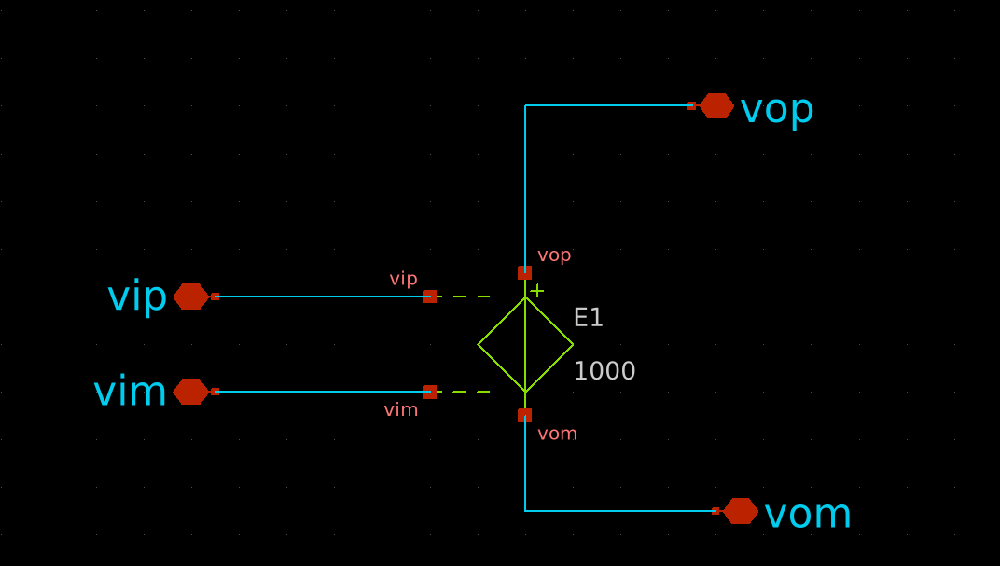

# Assignment 1

## Circuit Diagram

---

## Question 1: Determine the type of circuit

**Answer:**  
The given circuit is an **active high-pass filter** implemented using an **inverting op-amp configuration**. The input signal passes through a capacitor followed by a resistor, which together form the high-pass filtering stage. The op-amp amplifies the filtered signal with a gain determined by the ratio of the feedback and input resistors.

---

## Question 2: Write the s-domain transfer function for the circuit

**Answer:**  
Given component values:
- $C_i = 4.7 \, \mu\text{F}$
- $R_i = 5 \, \text{k}\Omega$
- $R_f = 5 \, \text{k}\Omega$

The transfer function $H(s)$ for an inverting high-pass filter is:

$$
H(s) = -\frac{R_f}{R_i} \cdot \frac{sRC}{1 + sRC}
$$

Substituting the given values:

$$
H(s) = -1 \cdot \frac{s \cdot 5000 \cdot 4.7 \times 10^{-6}}{1 + s \cdot 5000 \cdot 4.7 \times 10^{-6}}
$$

$$
H(s) = -\frac{0.0235s}{1 + 0.0235s}
$$

---

## Question 3: Find the frequency of the -3 dB point (high-pass corner frequency)

**Answer:**  
The -3 dB corner frequency $f_c$ is given by:

$$
f_c = \frac{1}{2\pi RC}
$$

Substitute values:

$$
f_c = \frac{1}{2\pi \cdot 5000 \cdot 4.7 \times 10^{-6}} \approx 6.77 \, \text{Hz}
$$

So, the cutoff frequency of the filter is **approximately 6.77 Hz**.

---

## This is the schematic created in xschem with the required components.

---

## ➤ Schematic of opam with vcvs source:

> 

- This schematic models the opamp using a simple **Voltage-Controlled Voltage Source (VCVS)**.
- Gain is set to **1000** using parameter `E1` in SPICE.

## ➤ Symbol of opam created:

> 

---

## ➤ Maximum Gain and Frequency at Maximum Gain  
- **Maximum Gain**: -1.75445e-02  

---

## ➤ -3 dB Frequency from Plot  
- **-3 dB Frequency**: 6.788495 Hz  

---

## ➤ For Gain = 10000  
- **Gain (dB)**: -1.737024e-03 dB  
- **-3 dB Frequency**: 6.788495 Hz  

#### ➤ Input Waveform:

- Type: Sine
- Amplitude: 100 mV peak
- Frequencies:
  - `f1 = 6.788495 Hz` (–3 dB point)
  - `f2 = 67.88495Hz` (10× –3 dB point)

#### ➤ Transient Simulation Plots:

**At –3 dB Frequency:**

> 

- **Vpp (Output)** ≈ 11.98 mV
- **Gain** = Vout_peak / Vin_peak = 11.98 / 100 = **0.1198**

**At 10× –3 dB Frequency:**

> 

- **Vpp (Output)** ≈ 44.48534 mV
- **Gain** = 9.8 / 100 = **0.4448534**

---

### ➤ Conclusion:

| Frequency      | Output Vpp | Gain     |
|----------------|------------|----------|
| 6.788495 Hz    | 11.9 mV    | 0.1198   |
| 67.788495 Hz   | 44.4 mV    | 0.4448   |

---

