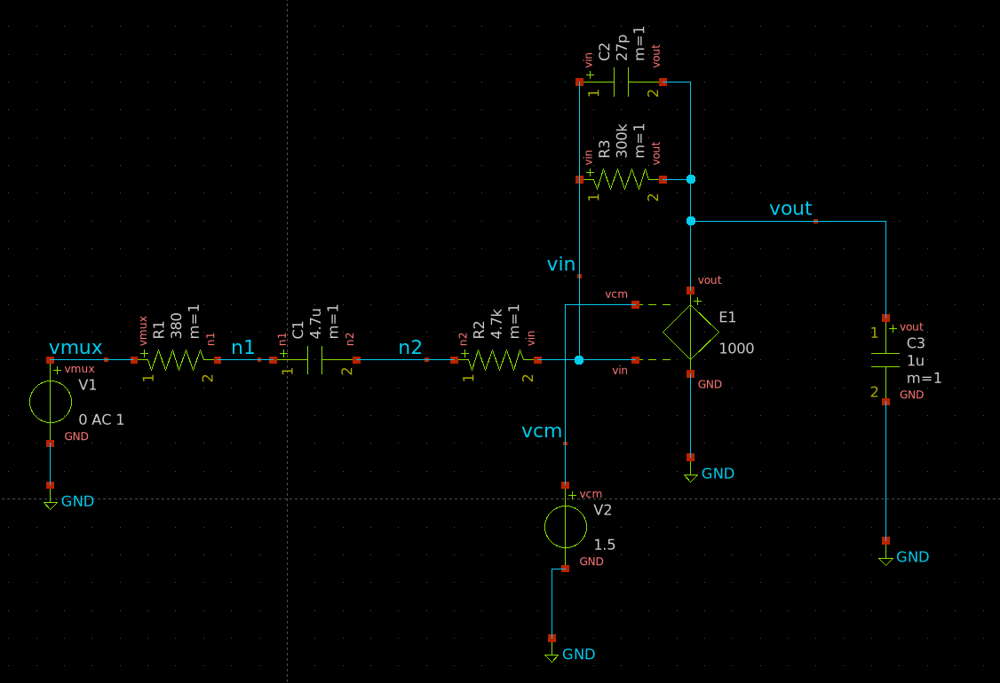
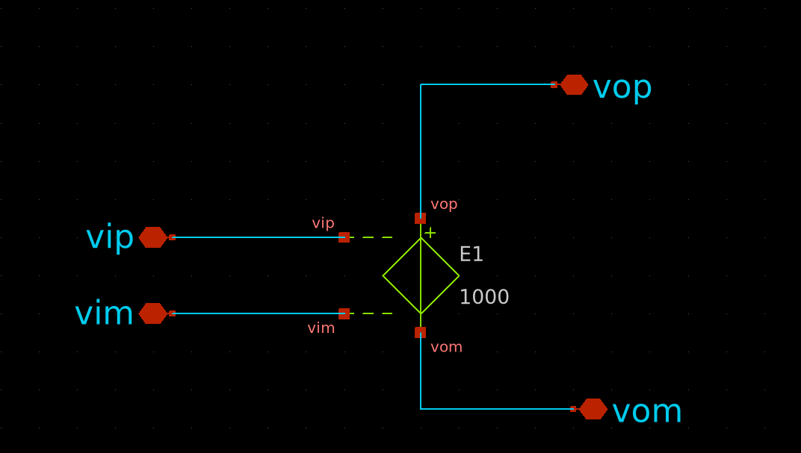
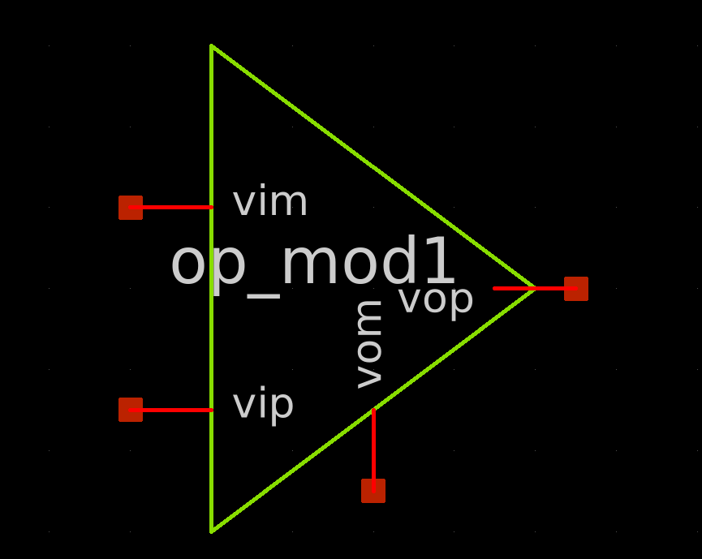
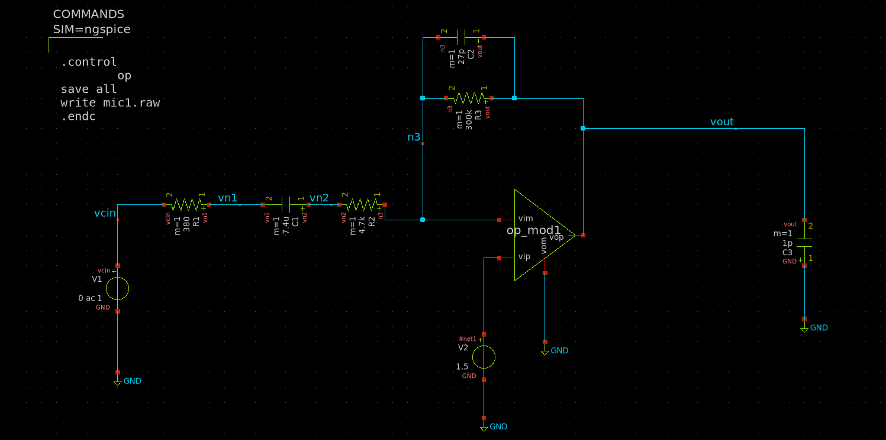
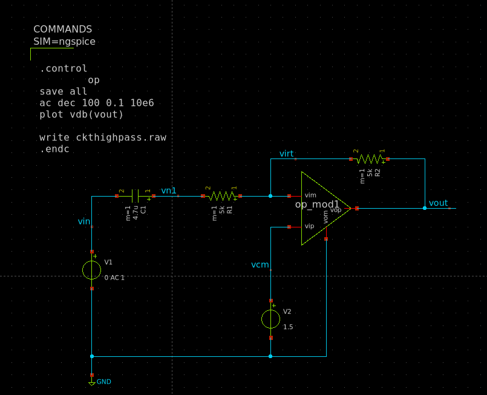
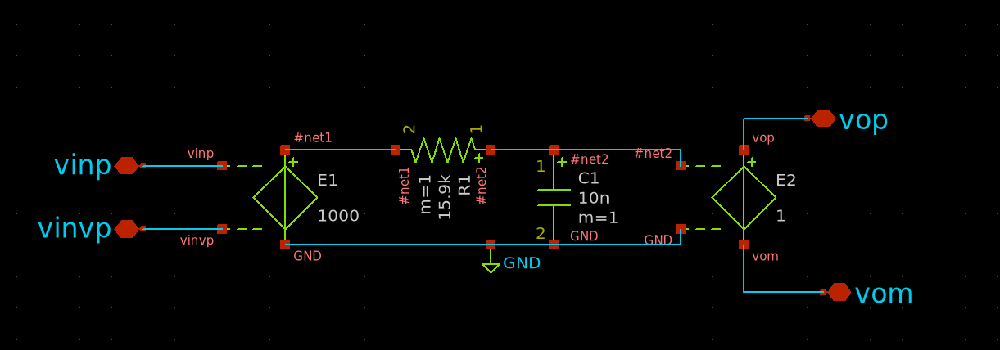
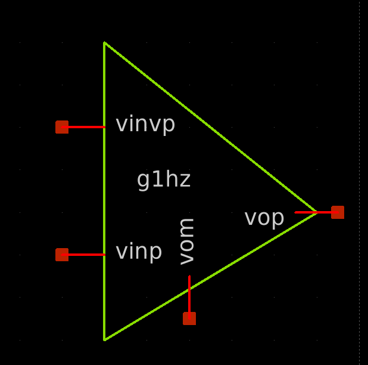
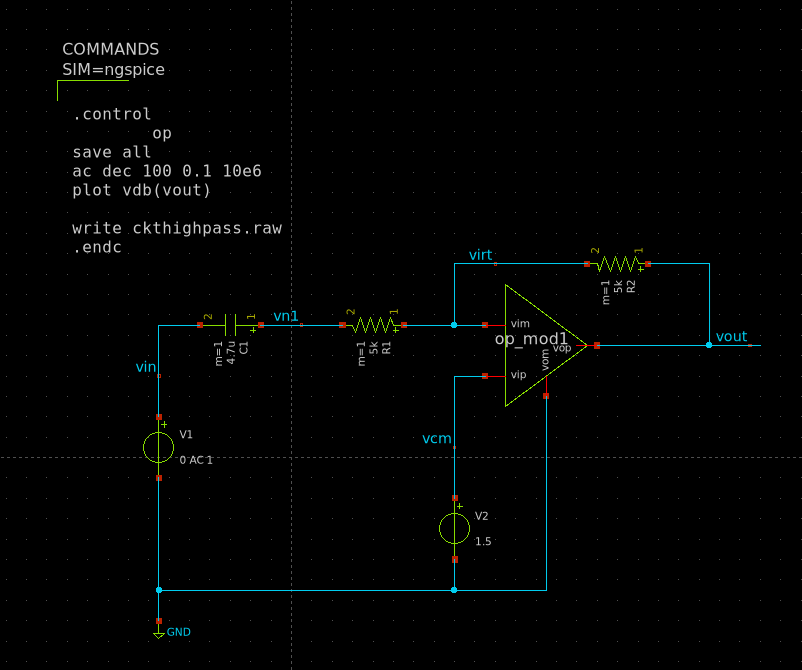

## Xschem circuit and opam diagram

- MEMS microphone design
 

- Opam Design for MEMS
 

- opam of mems

- MEMS microphone design with its opam
  

- High pass filter circuit with opam

- Circuit for a buffer for high pass circuit
  

- Op-am design for a high pass circuit
  

- High pass filter with buffer opam

