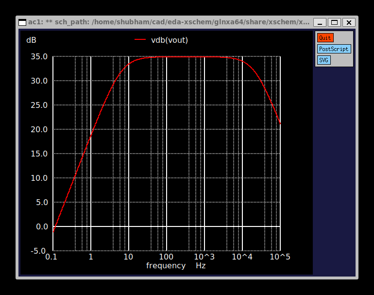
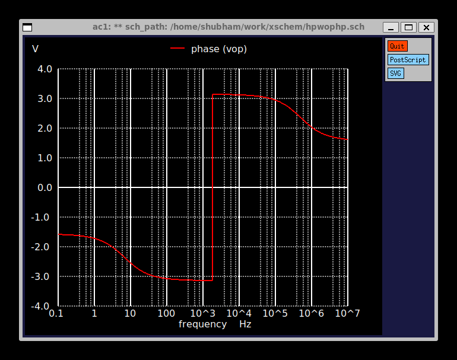
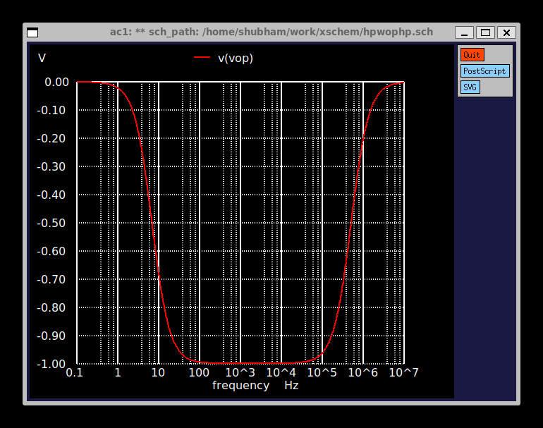
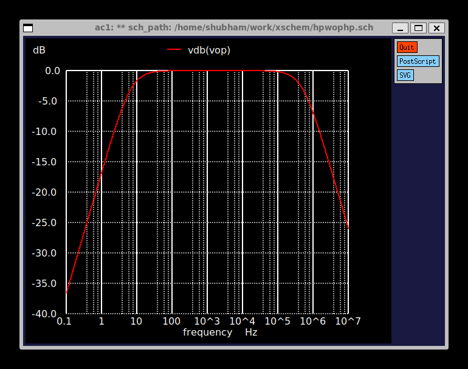

- Phase plot of (mems chip)

 

 
- plot of output in linear scale (mems chip)

  
- Plot of output in db scale (mems chip)

- Phase plot (Highpass circuit)

- Plot of output in linear scale(highpass circuit)

- Plot of output in db scale(highpass circuit)
 

